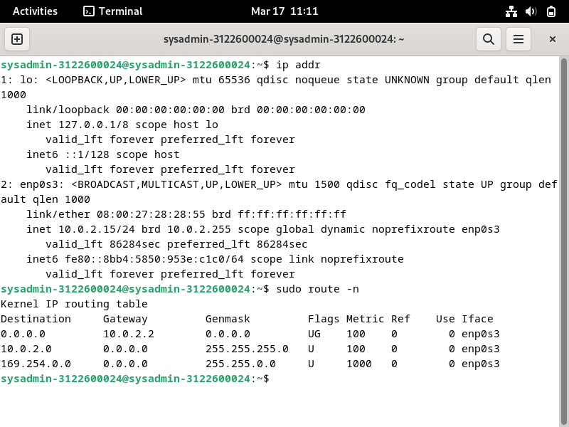
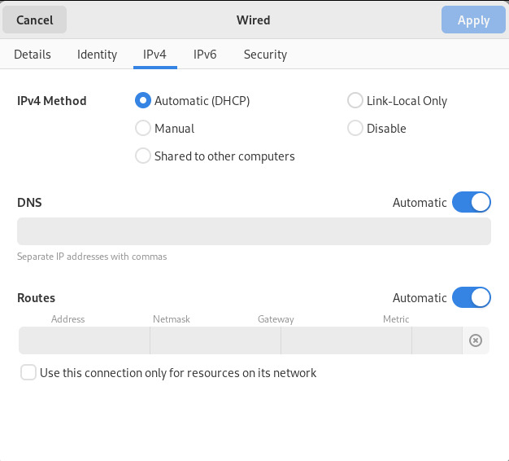
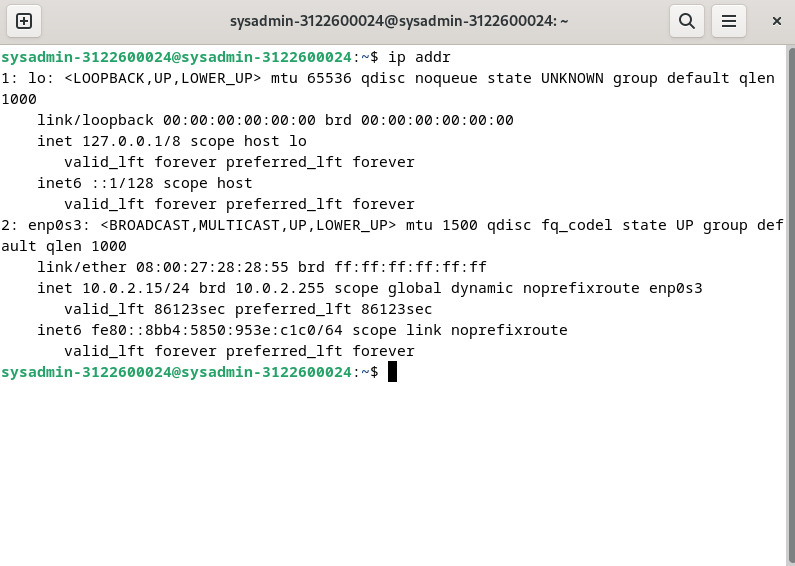

    Nama		        : Fasihul Ilmi
    NRP		        : 3122600027
    Kelas		        : 2 D4 IT A
    Mata Kuliah	        : Workshop Administrasi Jaringan
    Dosen Pengampu	        : Dr. Ferry Astika Saputra S.T., M.Sc

# TUGAS 2.3 DHCP to Manual

## Capture

1. Langkah pertama : Melakukan checking ip address awal
2. Langkah kedua : Melakukan checking ip gateway
    

    
    
<strong>Gambar 1:</strong>IP Addr

    

3. Langkah ketiga : Menambahkan profile network baru dengan konfigurasi seperti gambar
    

    
    
<strong>Gambar 3:</strong>Add New Network Profile

    

4. Langkah keempat : Melakukan checking ulang ip baru
    

    
    
<strong>Gambar 4:</strong>Checking New IP Addr

    
