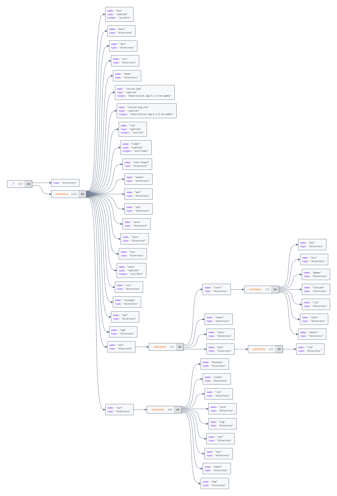

    Nama		        : Fasihul Ilmi
    NRP		            : 3122600027
    Kelas		        : 2 D4 IT A
    Mata Kuliah	        : Workshop Administrasi Jaringan
    Dosen Pengampu	    : Dr. Ferry Astika Saputra S.T., M.Sc

# TUGAS 2.1 Linux Directory Structure

## Directory Tree

<div align="center">
   
   <p><strong>Gambar 1:</strong>Linux Directory Structure</p>
</div>

</br>

```bash
/
├── bin -> usr/bin
├── boot
├── dev
├── etc
├── home
├── initrd.img -> boot/initrd.img-6.1.0-18-amd64
├── initrd.img.old -> boot/initrd.img-6.1.0-18-amd64
├── lib -> usr/lib
├── lib64 -> usr/lib64
├── lost+found
├── media
├── mnt
├── opt
├── proc
├── root
├── run
├── sbin -> usr/sbin
├── srv
├── storage
├── sys
├── tmp
├── usr
│   ├── local
│   │   ├── bin
│   │   ├── etc
│   │   ├── games
│   │   ├── include
│   │   ├── lib
│   │   ├── sbin
│   │   └── share
│   ├── share
│   ├── sbin
│   └── bin
│       └── lib
└── varx`
    ├── backups
    ├── cache
    ├── lib
    ├── lock
    ├── log
    ├── opt
    ├── run
    ├── spool
    └── tmp
```
<p align="center"><strong>Gambar 2:</strong>Directory Tree</p>

## Penjelasan Directory

## Struktur Direktori dalam Sistem Linux
<ol>
<li><code>bin</code>: Direktori ini berisi file eksekusi yang digunakan oleh sistem dan pengguna. Ia biasanya termasuk perintah seperti <code>ls</code>, <code>cp</code>, <code>mv</code>, dll.</li>
<li><code>boot</code>: Direktori ini berisi file-file yang diperlukan untuk proses boot sistem. Ia termasuk gambar kernel (<code>vmlinuz</code>), initial ramdisk (<code>initrd.img</code>), dan file-file lain yang boot-related.</li>
<li><code>dev</code>: Direktori ini berisi file perangkat keras yang mewakili perangkat keras di sistem. File-file ini dibuat oleh kernel saat mendeteksi perangkat keras baru.</li>
<li><code>etc</code>: Direktori ini berisi file konfigurasi sistem-wide. Ia termasuk file konfigurasi untuk layanan seperti <code>sshd</code>, <code>httpd</code>, dll, serta settingan sistem-wide seperti <code>/etc/hosts</code>, <code>/etc/fstab</code>, dll.</li>
<li><code>home</code>: Direktori ini berisi direktori home dari pengguna di sistem. Setiap pengguna memiliki subdirektori sendiri di <code>/home</code>, yang berisi file-file, direktori, dan file konfigurasi pribadi.</li>
<li><code>lib</code>: Direktori ini berisi perpustakaan berbagi yang digunakan oleh banyak program di sistem. Perpustakaan ini berisi fungsi dan data umum yang dapat digunakan oleh banyak program sekaligus.</li>
<li><code>lib64</code>: Direktori ini mirip dengan <code>/lib</code>, tetapi berisi perpustakaan 64-bit. Perpustakaan ini digunakan oleh program 64-bitdi sistem.</li>
<li><code>media</code>: Direktori ini digunakan untuk memasang media removable seperti USB drive, CD, dan DVD. File dan direktori di direktori ini biasanya dibuat dan diatur oleh pengguna atau oleh layanan automount.</li>
<li><code>mnt</code>: Direktori ini digunakan untuk memasang sistem file sementara. File dan direktori di direktori ini biasanya dibuat dan diatur oleh pengguna atau oleh layanan automount.</li>
<li><code>opt</code>: Direktori ini digunakan untuk menginstal perangkat lunak opsional. Ia biasanya termasuk subdirektori untuk setiap perangkat lunak, dengan setiap subdirektori berisi file-file untuk perangkat lunak tersebut.</li>
<li><code>proc</code>: Direktori ini adalah filesystem virtual yang menyediakan informasi tentang sistem dan proses. Ia tidak mengandung file-file yang sebenarnya, tetapi informasi runtime sistem.</li>
<li><code>root</code>: Direktori ini adalah direktori home dari pengguna root, yang merupakan akun superuser di sistem.</li>
<li><code>run</code>: Direktori ini digunakan untuk menyimpan file-file runtime untuk layanan dan aplikasi sistem. Ia digunakan untuk menyimpan file yang diperlukan saat layanan atau aplikasi berjalan, tetapi tidak diperlukan setelah layanan atau aplikasi dihentikan.</li>
<li><code>sbin</code>: Direktori ini berisi file eksekusi sistem yang digunakan oleh administrator sistem. Ia biasanya termasuk perintah seperti <code>mount</code>, <code>ifconfig</code>, <code>reboot</code>, dll.</li>
<li><code>srv</code>: Direktori ini digunakanuntuk menyimpan data untuk layanan yang disediakan oleh sistem. Ia biasanya termasuk subdirektori untuk setiap layanan, dengan setiap subdirektori berisi data untuk layanan tersebut.</li>
<li><code>sys</code>: Direktori ini adalah filesystem virtual yang menyediakan informasi tentang perangkat keras dan driver sistem. Ia tidak mengandung file-file yang sebenarnya, tetapi informasi runtime sistem.</li>
<li><code>tmp</code>: Direktori ini digunakan untuk menyimpan file-file temporer yang dibuat oleh sistem atau pengguna. Ia biasanya dibersihkan secara berkala oleh sistem.</li>
<li><code>usr</code>: Direktori ini berisi file-file dan direktori yang berkaitan dengan pengguna. Ia termasuk subdirektori untuk binaries (<code>/usr/bin</code>), perpustakaan (<code>/usr/lib</code>), dokumentasi (<code>/usr/share/doc</code>), dan file-file lain yang berkaitan dengan pengguna.</li>
<li><code>var</code>: Direktori ini berisi file-file dan direktori yang berubah selama operasi sistem. Ia termasuk subdirektori untuk file log (<code>/var/log</code>), email sistem (<code>/var/mail</code>), dan data lain yang berubah.</li>
<li><code>var/backups</code>: Direktori ini digunakan untuk menyimpan backups sistem.</li>
<li><code>var/cache</code>: Direktori ini digunakan untuk menyimpan cache data untuk layanan dan aplikasi sistem.</li>
<li><code>var/lib</code>: Direktori ini digunakan untuk menyimpan informasi status variabel untuk layanan dan aplikasi sistem.</li>
<li><code>var/lock</code>: Direktori ini digunakan untuk menyimpan file-file lock untuk layanan dan aplikasi sistem.</li>
<li><code>var/log</code>: Direktori ini diguk menyimpan fileunakan untuk menyimpan file log-file lock untuk lay untuk layanan dananan dan aplikasi sistem. aplikasi sistem.</li>
<li><code>var/opt</code>: Direktori</li>
<li><code>var/log</code>: Direktori ini digunakan untuk meny ini digunakan untukimpan data menyimpan file log unt variabel untuk peruk layanan dan aplikasi sistem.</li>
<li><code>varangkat lunak opsional. /opt26. </code>var/run`: Direktori ini digunakan untuk menyimpan file-file runtime untuk layanan dan aplikasi sistem.</li>
<li><code>var/sp</code>: Direktori ini digunakool`: Direktori ini digan untuk menyimpan data variabel untuk perangkat lunak opsional.</li>
<li><code>var/rununakan untuk</code>: Direktori ini digunakan untuk menyimpan file-file menyimpan data sp runtime untuk layanan dan aplikasi sistem.
ool untuk layanan dan27. <code>var/spool</code>: Direktori ini digunakan untuk menyimpan data sp aplikasi sistem.</li>
<li><code>var/tmp</code>: Direktori ini digunakan untuk menyimpan file-fileool untuk layanan dan aplikasi sistem.</li>
<li><code>var/tmp</code>: temporer yang dibuat oleh layanan dan aplikasi sistem. Ia biasanya direktori yang dibersihkan secara berkala oleh sistem.</li>
</ol>